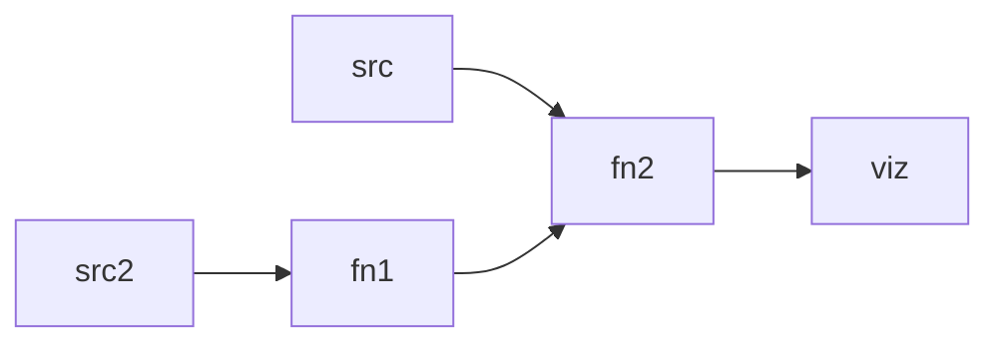

# libfunctional_dag (or lambdag $\lambda$g)

A functional dag is a multi-threaded design pattern that runs simple $\lambda$ functions, enforced to be structured as a directed acyclic graph (DAG). This project enforces one other important quality which is being strongly typed. Users of this library will know, right away, that types are incompatible during compile time which reduces runtime checking during message passing between the nodes.

## Why would you want this?
Cognitive architectures can become very complicated very fast. Typically when designing these complex cognitive architectures, we're left with either a single path through the code network (e.g. a neural network) or giant speghetti code architectures used in research that are more experimental. This library was built primarily with cognitive perception systems in mind. While not impossible, it is challenging to push information back to early pre-processing stages. This constraint makes users of this library think twice about what assumptions they've made in which state needs to be transmitted back up the DAG. On the other hand, it is also more expressive than typical AI pipelines that force data through the entire network regardless of whether the data should be transmitted. This flow pattern is ideal for some cognitive systems like robotic vision and some single direction modules within larger cognitive architectures.

### Build and install
OS Support:  

Status: [](https://github.com/petroglyf/functional-dag/actions/workflows/cmake-ubuntu-build.yml?query=branch%3Amain)  [](https://github.com/petroglyf/functional-dag/actions/workflows/cmake-ubuntu-test.yml?query=branch%3Amain)

The build is CMake based and is built for cxx20 standards. First class build support is given to Ubuntu and MacOS through the [homebrew](https://brew.sh/) infrastrucure.

#### Installing via homebrew
```bash
$ brew tap petroglyf/functional-dag https://github.com/petroglyf/functional-dag
$ brew install petroglyf/functional-dag/functional-dag
```

#### Installing via aptitude
```bash
$ curl -s --compressed "https://petroglyf.github.io/ppa/KEY.gpg" | gpg --dearmor | sudo tee /etc/apt/trusted.gpg.d/ppa.gpg >/dev/null
$ sudo curl -s --compressed -o /etc/apt/sources.list.d/packages.list "https://petroglyf.github.io/ppa/packages.list"
$ apt update
$ apt install functional-dag
```
## User docs
There are two ways to use this. 1) Load a DAG via JSON, and 2) Construct the DAG in c++. 

If you'd like to create a codepath as follows:


Then you would create 2 sources, and 3 nodes where 2 of the nodes are simple functions to be called and the last one is a visualizer. Each edge in the DAG is strongly typed and every node has "slots" in which it can receive data. This allows fan-in and fan-out architectures. 

filter_sys.hpp provides the main hooks into the library. All you need to do is `#include <functional-dag/filter_sys.hpp` and create a dag. 

API docs can be found [here](https://petrogly-ph.github.io/functional-dag/annotated.html).
### Build dependencies
This project tries to minimize dependencies so as to not stack dependencies across larger projects and to make it easier to build simple layers to other languages like python. 

Build dependencies:
* Cmake
* jsoncpp 
* ctest (if you want to unit test)
* clang-tidy (if you want to lint the code as well)
* doxygen (if you would like to generate docs)

Dependencies during testing:
* Catch2 (for unit testing)

Runtime dependencies
* jsoncpp


### How to contribute to the code
We work on issues. If you'd like to help out, take a look at the [issues](https://github.com/petrogly-ph/functional-dag/issues), assign a free one and start coding! 

You're also welcome to perform unsolicited push requests to main and ask for a review. We'll be happy to take a look and provide feedback.

You can also help out by simply providing bug reports! 


